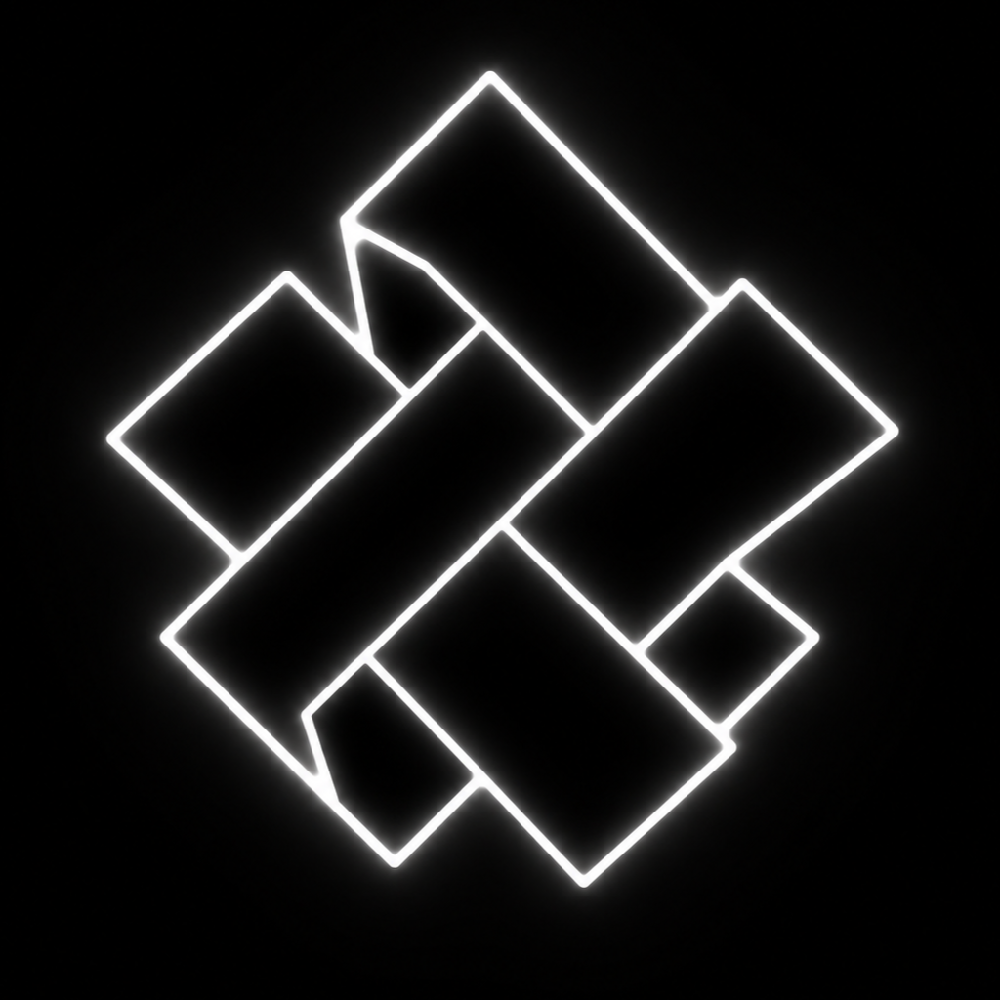

<div align="center">
  

  # 🌌 Shade Launcher

  **Reproducible profiles. One deduplicated library. Scriptable workflows.**
  
  *Built in Rust with Tauri.*

  <p align="center">
    
    
    
  </p>

  <p align="center">
    <a href="#-what-is-shade">What is Shade?</a> •
    <a href="#-why-choose-shade">Why Shade?</a> •
    <a href="#-installation">Installation</a> •
    <a href="#-quick-start">Quick Start</a>
  </p>

  
</div>

---

## 🌟 What is Shade?

**Shade** is a Minecraft launcher with a global deduplicated library and declarative profiles (plain JSON). It materializes clean instances from a single source of truth, integrates flawlessly with **Modrinth** and **CurseForge**, and supports scriptable workflows via a CLI, while providing a stunning, polished desktop experience. Built in Rust with Tauri for a lightning-fast, lightweight app.

> Define profiles in plain JSON, install content from Modrinth/CurseForge, and launch clean instances without duplicating the same mods across every pack!

---

## ✨ Why Choose Shade?

### 💾 **Save Disk Space**
Install the same mod in 10 profiles, it's stored **once**. Shade uses a SHA-256 content-addressed store, so identical files are never duplicated. Say goodbye to 50GB of redundant mod copies eating up your drive!

### 🔄 **Reproducible Profiles**
Your entire setup is a single JSON file. Version control it with Git, share it with friends, diff changes between versions, and restore it anytime. Profiles are declarative: the launcher materializes clean instances on demand.

### 🕵️ **No Hidden State**
Plain JSON on disk. Predictable directory layout. Fully inspectable—no magic sync, no mystery database files, no state you can't see. If something breaks, you can debug it yourself.

### ⚡ **Fast & Lightweight**
A polished desktop UI for everyday play, backed by a serious CLI for scripting. Built in Rust with Tauri for minimal resource usage, snappy behavior, and near-instant startup.

### 🔒 **Private & Secure**
No telemetry, no launcher account required. Your data stays local. Works perfectly offline after initial setup.

---

## 🛠️ Features

| Feature | What it means for you |
|:---|:---|
| 📦 **Content-Addressed Store** | Mods stored once by hash, shared across all profiles |
| 📜 **Declarative Profiles** | JSON manifests you can version control and share |
| 👤 **Multi-Account** | Switch Microsoft accounts instantly with secure token storage |
| 🌐 **Modrinth + CurseForge** | Search and install from both platforms directly in-app |
| ⚙️ **All Mod Loaders** | Fabric, Forge, Quilt, NeoForge with automatic version resolution |
| 💻 **CLI + Desktop** | Full-featured CLI for automation, polished UI for daily use |

---

## 📥 Installation

### Download
Get the latest release from our [Releases page](https://github.com/RedsOrb/Shade_Launcher/releases).

- 🍏 **macOS**: `.dmg` installer
- 🪟 **Windows**: `.msi` installer
- 🐧 **Linux**: `.AppImage` or `.deb` package

---

## 🚀 Quick Start

Get up and running in seconds:

```bash
# Add your Microsoft account
shade account add

# Create a Fabric 1.21.4 profile
shade profile create my-profile --mc 1.21.4 --loader fabric

# Add a mod from Modrinth
shade mod add my-profile sodium

# Launch the game!
shade launch my-profile
```

---

## 🏗️ Architecture

Shade treats your game setup like code: **declarative**, **reproducible**, and **efficient**.

| Principle | Implementation |
|:---|:---|
| **Single source of truth** | Profiles are JSON manifests. Instances are derived artifacts, regenerated on demand. |
| **Deduplication** | SHA-256 content-addressed store. One file, infinite profiles. |
| **No magic** | Plain JSON on disk. Predictable layout. Fully inspectable state. |
| **Modular** | Auth, Minecraft data, and profiles are isolated. Swap or extend without breaking everything. |
| **CLI-first** | Every feature works from the command line. Script it, automate it, pipe it. |

---

## 📂 Data Layout

```text
~/.shade/
├── store/                    # Content-addressed storage
│   ├── mods/sha256/
│   ├── resourcepacks/sha256/
│   └── shaderpacks/sha256/
├── profiles/                 # Profile manifests
│   └── <id>/profile.json
├── instances/                # Materialized game directories
├── minecraft/                # Versions, libraries, assets
├── accounts.json             # Account tokens (keep private)
└── config.json               # Launcher settings
```

---


<div align="center">
  <p>Released under the <a href="LICENSE">MIT License</a>.</p>
</div>
